# Robot Operating System
ROS version Noetic

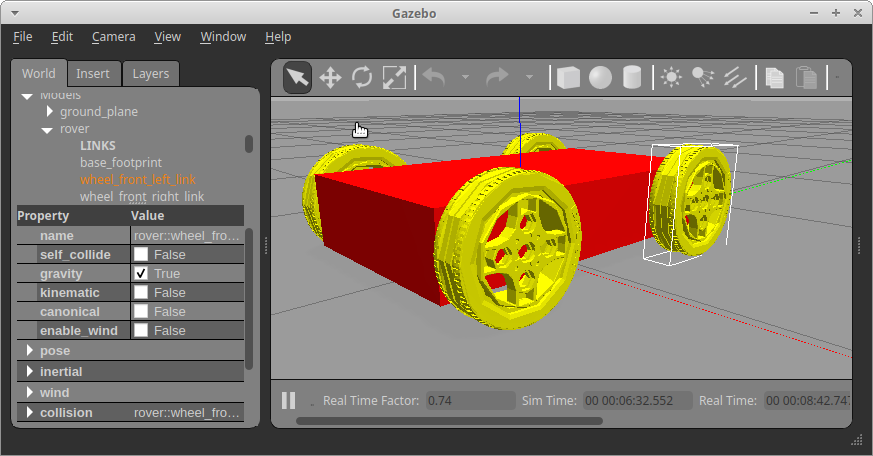

# Workspace
mkdir -p ~/test_ws/src

cd ~/test_ws/src

catkin_init_workspace

cd ~/test_ws

catkin_make

source devel/setup.bash

roscd - check ws

# Package
cd ~/test_ws/src

catkin_create_pkg mobile_robot std_msgs rospy urdf 
                xacro rviz gazebo tf2 
                geometry_msgs 
                joint_state_publisher_gui

cd ~/test_ws

catkin_make --only-pkg-with-deps mobile_robot

source devel/setup.bush

roscd mobile_robot

# URDF
mkdir urdf

roscd mobile_robot

touch rover.urdf

cd ~/test_ws

code .

# RViz And Gazebo
```
cd ~/catkin_ws/src/mobile_robot
```
```
mkdir launch
```
```
cd launch
```
```
touch rviz.launch
```
```
touch gazebo.launch
```
```
roslaunch mobile_robot rviz.launch
```
```
roslaunch mobile_robot gazebo.launch
```
# Gazebo Worlds
```
echo $GAZEBO_MODEL_PATH
```
```
export GAZEBO_MODEL_PATH=~/catkin_ws/src/mobile_robot/models:$GAZEBO_MODEL_PATH
```
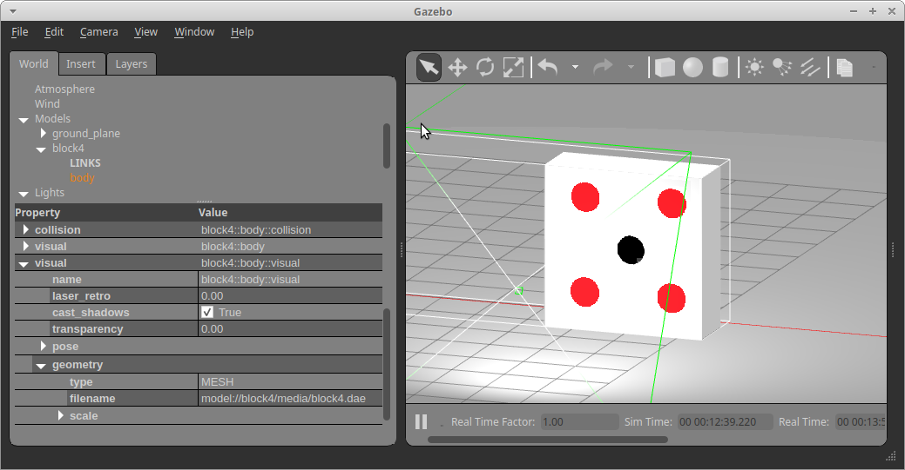

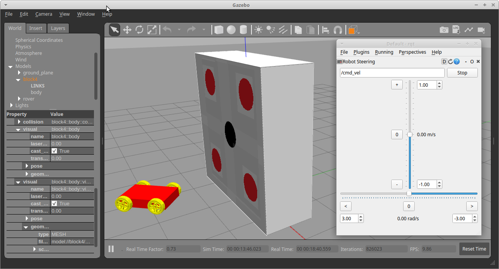

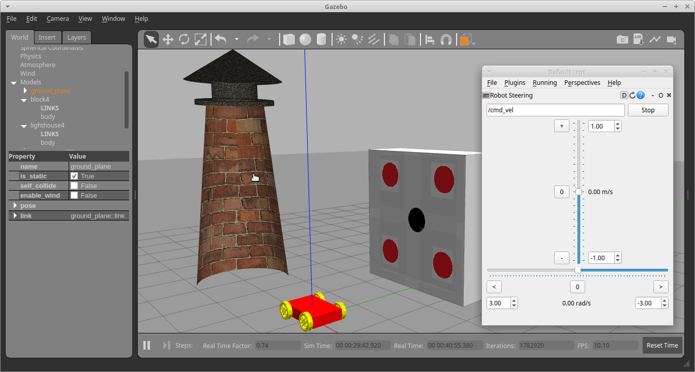

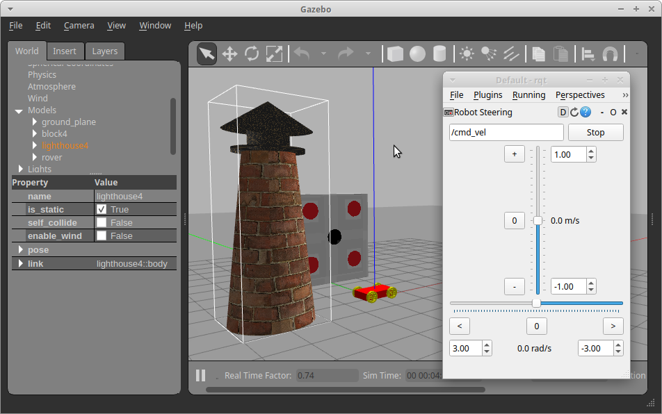

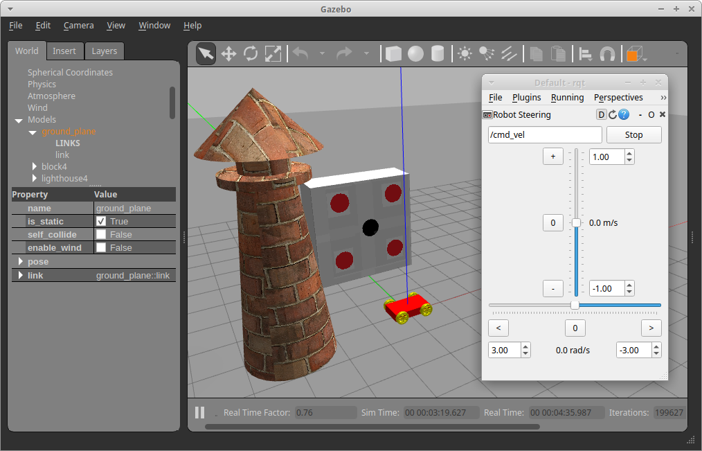

# Keyboard Teleoperations
```
sudo apt update
```
```
sudo apt install ros-noetic-teleop-twist-keyboard
```
```
rosrun teleop_twist_keyboard teleop_twist_keyboard.py
```

# Topics And Nodes Works
rqt / Plugins / Message Publisher

rqt / Plugins / Robot Tools / Robot Steering
```
rosnode list
```
```
rostopic list
```
```
rostopic pub /cmd_vel
```
```
rostopic echo /cmd_vel
```
```
rostopic echo /odom
```

# Python Scripts
```
cd ~/catkin_ws/src/mobile_robot/src
```
```
touch test_publisher.py
```
```
chmod +x test_publisher.py
```
```
rosrun mobile_robot test_publisher.py
```


# Visual Studio Code

Ctrl + Shift + P

run Extension VS Code

ROS Preview URDF

ROS Microsoft Pre-release

URDF smilerobotics urdf/xacro snippets

ROS Snippets Liews Wuttipat

Ctrl + ], [ - Indent

Ctrl + / - comment line

# Introspection
printenv | grep ROS

roscd

# Linux Console 
### Disable Auto Logout Screen
```
xfce4-screensaver-preferences
```
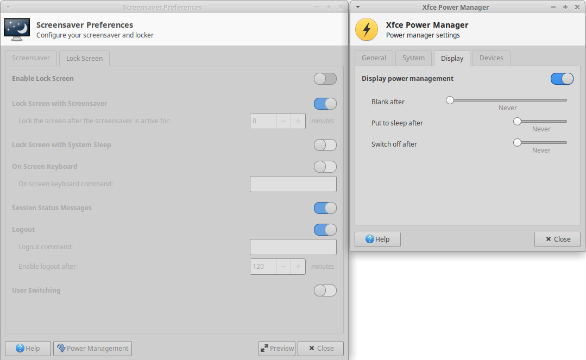
### Colors In Console
Consoles tty1, tty2, ..., tty6
Ctrl + F1, Ctrl + F2, ..., 
```
setterm --background white --foreground black --store
```
Ctrl + L - clear console.
### Colors In Terminal Emulator Of Xubuntu
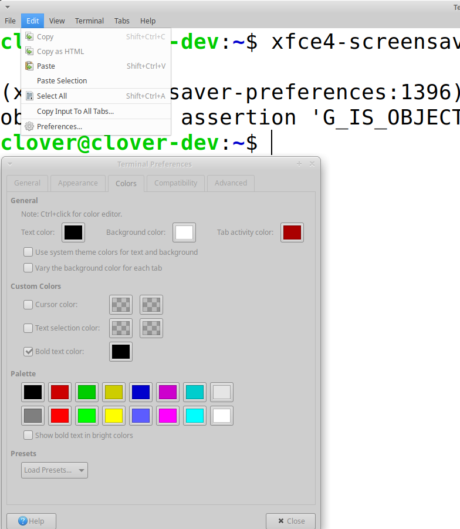

# Images for GitFlic

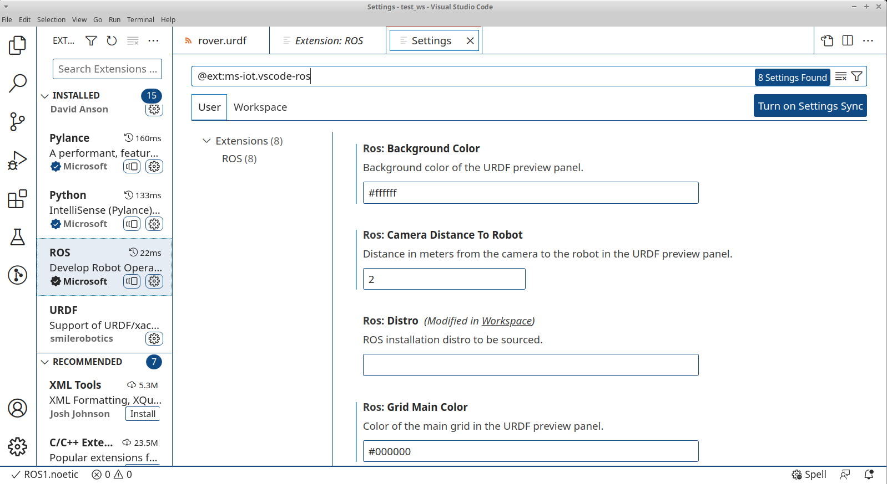

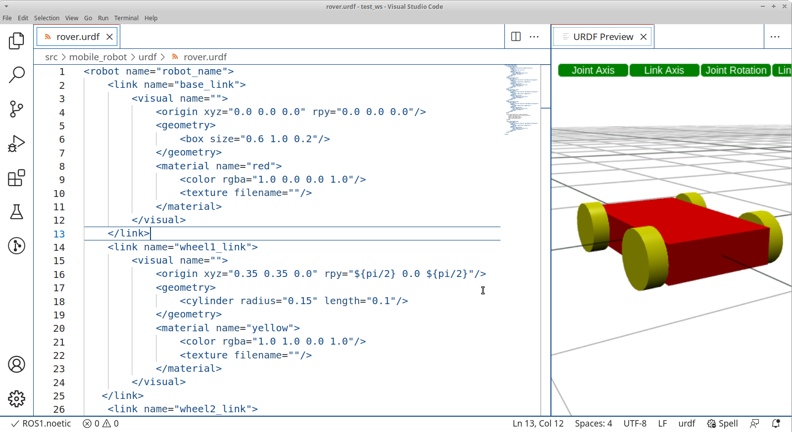

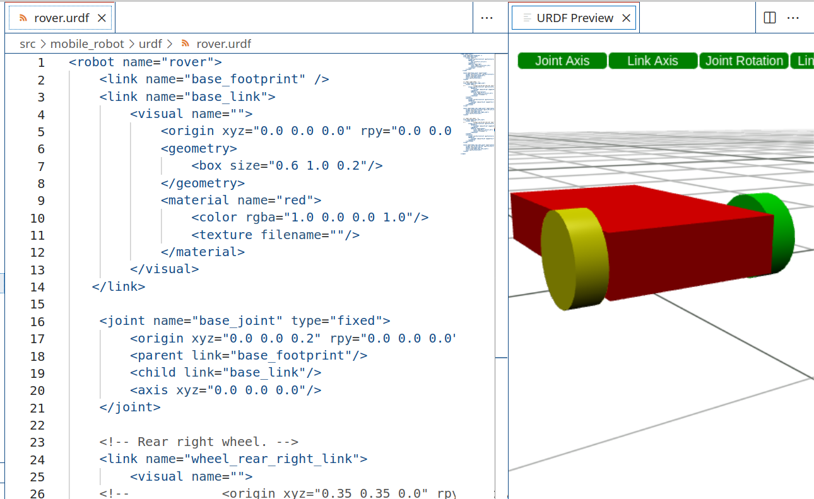

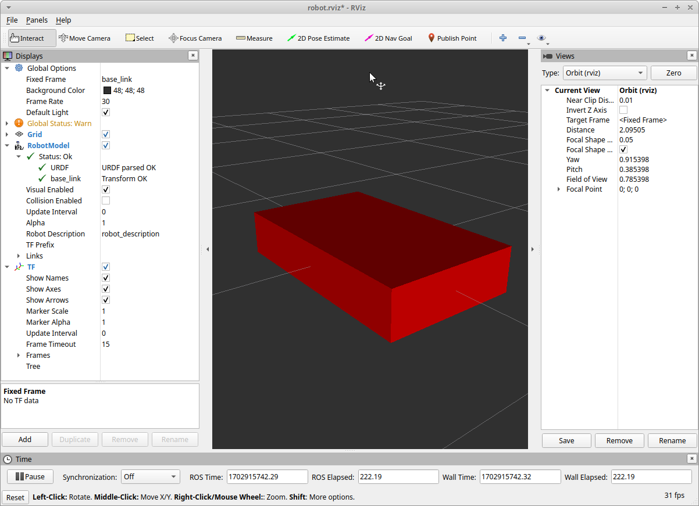

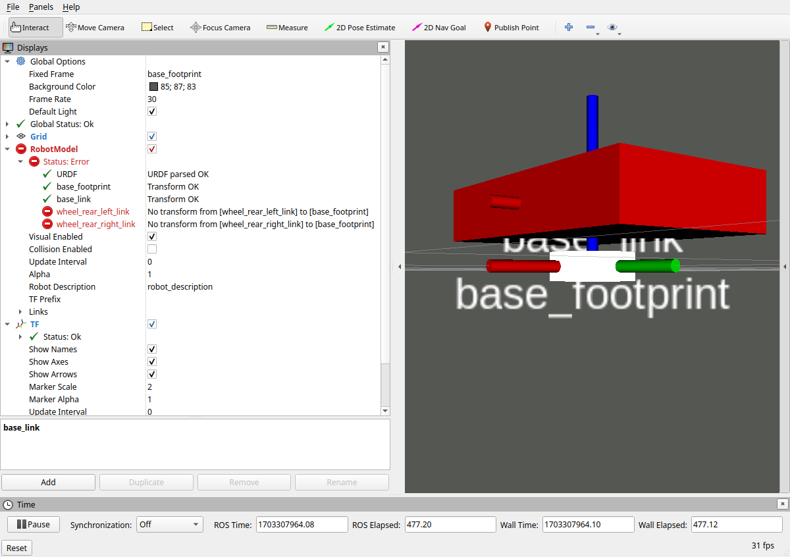

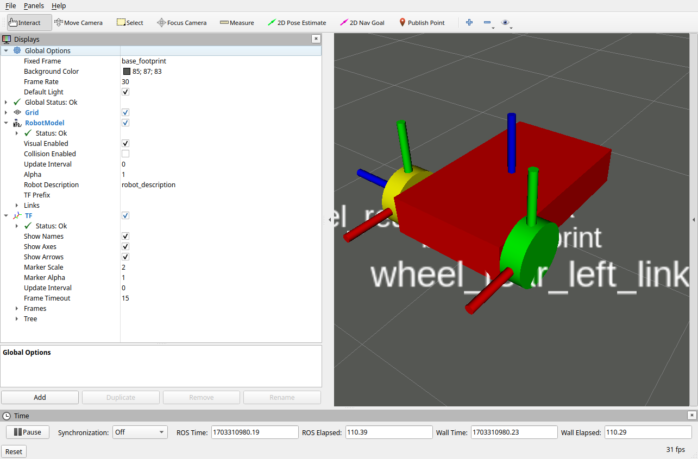

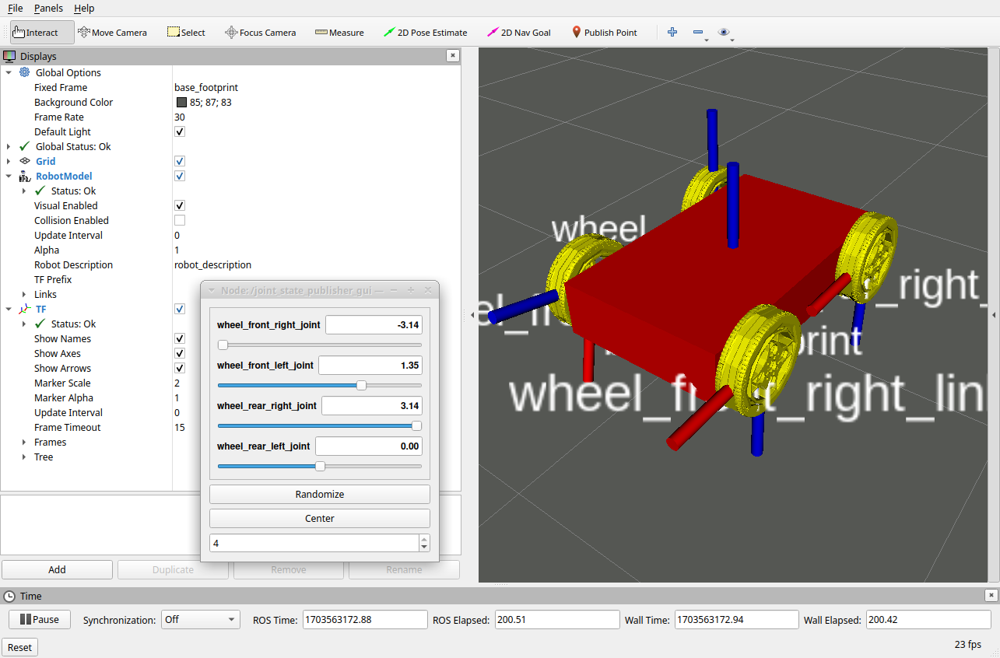

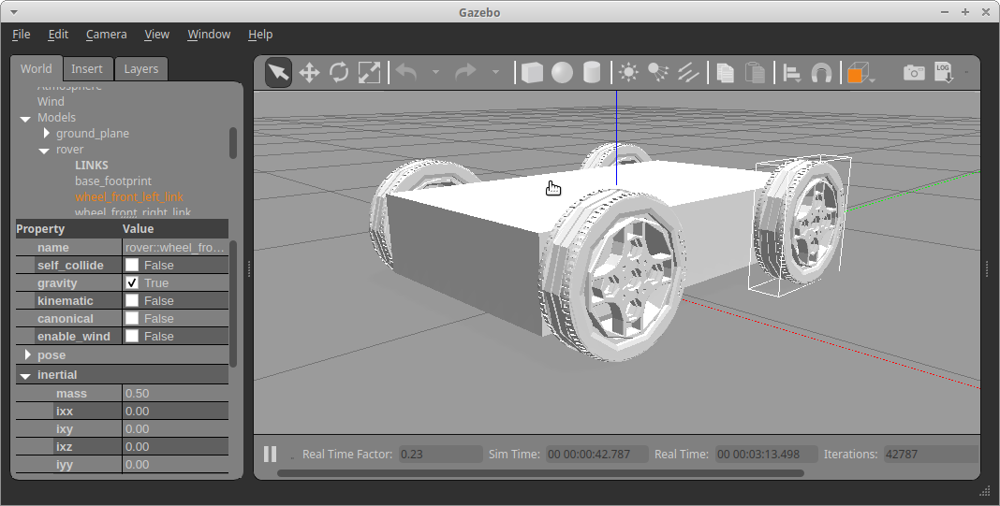


# Hyperlinks

1. [ROS Noetic with Ubuntu 20.04 Focal ](https://github.com/CopterExpress/clover_vm/releases/tag/v1.4) virtual machine image (.ova file, 5.3G) from Copter Express, qudrocopter Clover simulation.

1. [youtube.com&nbsp;&mdash;  ROS Wiki Demonstrations](https://www.youtube.com/playlist?list=PLBbhfIdh4NdgBBkX7q0Y3UukO2_ZoICee) 
Muhammad Luqman 13 videos - 24,361 views - Last updated on Apr 26, 2023

1. [wikipedia.org&nbsp;&mdash;  List of moments of inertia](https://en.wikipedia.org/wiki/List_of_moments_of_inertia)

1. [youtube.com - How to create terrain for Gazebo simulation with Blender 2.9](https://www.youtube.com/watch?v=GNbH8Pf7nGk)&nbsp;&mdash; Kevin DeMarco 132 subscribers 5,100 views  Dec 7, 2021